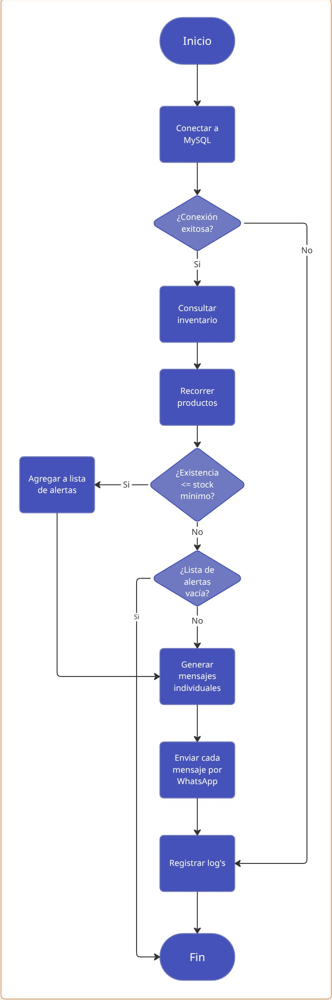

# Arquitectura del Sistema

## Descripción general
El proyecto está desarrollado como una aplicación monolítica en Python, diseñada para ejecutarse de forma local o como ejecutable standalone.

## Componentes principales
1. Módulo de conexión a base de datos
2. Módulo de lectura y procesamiento de inventario
3. Lógica de validación de stock mínimo
4. Módulo de alertas

## Flujo de ejecución
1. Inicio de la aplicación
2. Conexión a la base de datos
3. Lectura de datos de inventario
4. Evaluación de niveles de stock
5. Generación de alertas
6. Finalización del proceso

## Decisiones técnicas
- Se eligió Python por su rapidez de desarrollo y ecosistema.
- MySQL se utiliza por su robustez y facilidad de integración.
- PyInstaller permite distribuir el sistema sin dependencias externas.

## Alcance de la arquitectura

La arquitectura actual está pensada para ejecución local y uso individual.
No contempla múltiples usuarios ni ejecución concurrente.

## Integración con sistema de punto de venta

El sistema se conecta directamente a la base de datos del punto de venta para consultar información de productos y existencias.

La lógica de negocio se mantiene desacoplada del POS, permitiendo adaptar el sistema a otras bases de datos con estructuras similares.

## Limitaciones actuales

- El sistema está diseñado para ejecución local.
- No contempla múltiples usuarios simultáneos.
- El stock mínimo es configurable a nivel de código.

## Diagrama de flujo inicial

Antes de iniciar el desarrollo del código, se elaboró un diagrama de flujo con el objetivo de definir la lógica general del sistema y los pasos principales del proceso.

Este diagrama representa la idea inicial del funcionamiento del sistema. Durante la implementación, algunos pasos fueron ajustados para mejorar la claridad y robustez del código.

